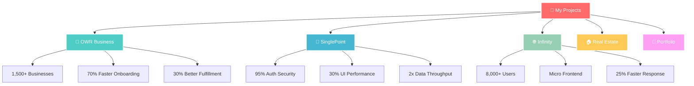

#  Hi there, I'm Vikash Sharma!

<div align="center">
  
</div>

<div align="center">
  
  
  
</div>


<div align="center">
  
</div>

## 🎨 **About Me**


```typescript
const vikash: Developer = {
  name: "Vikash Sharma",
  location: "India 🇮🇳",
  role: "Full Stack Developer",
  languages: ["JavaScript", "TypeScript", "Python", "Java"],
  frameworks: ["React", "Next.js", "Node.js", "Express"],
  databases: ["MongoDB", "PostgreSQL", "MySQL", "Redis"],
  tools: ["Docker", "AWS", "Git", "Figma"],
  currentFocus: "Building scalable web applications",
  funFact: "I debug with console.log and I'm proud of it! 😄"
};
```

<details>
<summary><b>🎯 Current Goals</b></summary>

- 🚀 Building next-generation web applications
- 🌱 Mastering advanced TypeScript patterns
- 🤝 Contributing to major open-source projects
- ☁️ Exploring cloud-native architectures
- 📱 Learning mobile development with React Native

</details>

---

## 🛠️ **Tech Arsenal**

<div align="center">

### **Frontend Universe**


### **Backend Powerhouse**


### **Database Kingdom**


### **DevOps & Tools**


### **Development Environment**


</div>

---

## 📊 **GitHub Analytics**

<div align="center">
  
  
</div>

<div align="center">
  
</div>

<div align="center">
  
</div>

---

### 💼 **Project Universe**

<div align="center">



</div>

<details>
<summary><b>🛒 OWR Business Online Store</b> </summary>

```yaml
🎯 Impact Metrics:
  - Businesses Served: 1,500+
  - Onboarding Reduction: 70%
  - Fulfillment Accuracy: +30%
  - Transaction Success: +25%

💻 Tech Architecture:
  Frontend: React.js, Redux
  Backend: Node.js, Express.js
  Database: PostgreSQL
  Cache: Redis
  AI: ChatGPT API
  
🚀 Key Features:
  ✅ No-code e-store builder
  ✅ Logistics integration (Delhivery)
  ✅ Multi-gateway payments (PhonePe, Cashfree)
  ✅ Internal warehouse management
```
**[🔗 Live Demo](https://owrbusiness.example.com/)**

</details>

<details>
<summary><b>🚀 SinglePoint</b> </summary>

```yaml
🎯 Performance Gains:
  - UI Responsiveness: +30%
  - Auth Security: 95% breach reduction
  - Data Throughput: 2x improvement
  - Server Efficiency: Optimized SSR

💻 Tech Stack:
  Frontend: Next.js, TypeScript
  Backend: ADO.NET
  Database: SQL Server
  Auth: JWT Implementation
  
🛠️ Architecture Highlights:
  ✅ Server-side API optimization
  ✅ Robust authentication flow
  ✅ Cross-team collaboration
  ✅ Enterprise-grade security
```
**[🔗 Live Demo](https://sp.mastertrust.co.in/login)**

</details>

<details>
<summary><b>🌐 Infinity</b> </summary>

```yaml
🎯 Scale Metrics:
  - Active Users: 8,000+
  - Response Time: +25%
  - Paperwork Reduction: 30%
  - Component Modularity: 100%

💻 Advanced Architecture:
  Frontend: React.js, Micro Frontends
  Deployment: Module Federation
  Messaging: Firebase Cloud Messaging
  Integration: Digio e-signature
  
🏗️ Design Patterns:
  ✅ Micro Frontend architecture
  ✅ Independent deployable components
  ✅ Real-time notification system
  ✅ Digital signature workflow
```
**[🔗 Live Demo](https://infinity.mastertrust.co.in/LoginPassword)**

</details>

<details>
<summary><b>🏠 Real Estate Frontend</b> </summary>

```yaml
🎯 User Experience:
  - Mobile Optimization: 100%
  - Load Time: <2s
  - Search Efficiency: Advanced filters
  - Engagement: Significantly improved

💻 Frontend Excellence:
  Framework: React.js, Next.js
  Styling: Tailwind CSS
  Performance: Optimized rendering
  Responsive: Multi-device support
  
✨ Key Features:
  ✅ Advanced property search
  ✅ Interactive UI elements
  ✅ Mobile-first design
  ✅ Fast load times
```
**[🔗 Live Demo](https://fortunecitypanvelproject.com/)**

</details>

<details>
<summary><b>🎨 Portfolio Website</b> </summary>

```yaml
🎯 Technical Excellence:
  - SEO Score: 95+
  - Performance: Lighthouse 90+
  - Animation: Smooth transitions
  - Accessibility: WCAG compliant

💻 Modern Stack:
  Framework: Next.js
  Styling: Tailwind CSS
  Animation: Framer Motion
  Deployment: Vercel
  
🎨 Design Features:
  ✅ Responsive design system
  ✅ Interactive animations
  ✅ Blog integration
  ✅ Project showcases
```
**[🔗 Live Demo](https://vikashsharma.vercel.app/)**

</details>

<div align="center">
  
</div>

  ---  
  
### 🎯 **Coding Metrics**

<table align="center">
  <tr>
    <td align="center">
      
    </td>
    <td align="center">
      
    </td>
  </tr>
</table>

  ---
  
  ### 🛠️ **Language Usage Breakdown**
  
  

  ---
  
  ### 📈 **Activity Graph**
  
  

  ---
  
  ### 🏆 **GitHub Trophies**
  
  

  ---
  
  <div style="display: flex; align-items: center; justify-content: center; gap: 20px; margin: 20px 0;">
    
    
    
  </div>

</div>

---

<div align="center">
  
  **💡 "Code is like humor. When you have to explain it, it's bad." - Cory House**
  
  <sub>📍 Track my coding journey • 🎯 Always learning • 🚀 Building the future</sub>
  
</div>

---

## 🌐 **Connect With Me**

<div align="center">

<a href="mailto:vikash9422@gmail.com">
  
</a>
<a href="https://linkedin.com/in/vikashsharmaa25">
  
</a>
<a href="https://twitter.com/vikashsharmaa25">
  
</a>
<a href="https://vikashsharma.vercel.app/">
  
</a>
<a href="https://github.com/vikashsharmaa25">
  
</a>
<a href="https://discord.gg/your-discord">
  
</a>

</div>

## ⚡ **Random Dev Quote**

<div align="center">
  
</div>

---

## 🎯 **2024 Goals Checklist**

- [x] 🚀 Launch 5 major projects
- [x] 📝 Write 20+ technical blog posts  
- [x] 🤝 Contribute to 10+ open source projects
- [ ] 🎓 Complete AWS certification
- [ ] 📱 Master React Native development
- [ ] 🌐 Learn Web3 technologies
- [ ] 🤖 Explore AI/ML integration

---

<div align="center">

### 💡 **"Code is like humor. When you have to explain it, it's bad."**


### 🚀 **Thanks for visiting! Let's build something amazing together!**


</div>

---

<div align="center">
  
**[⬆ Back to Top](#-hi-there-im-vikash-sharma)**

</div>
